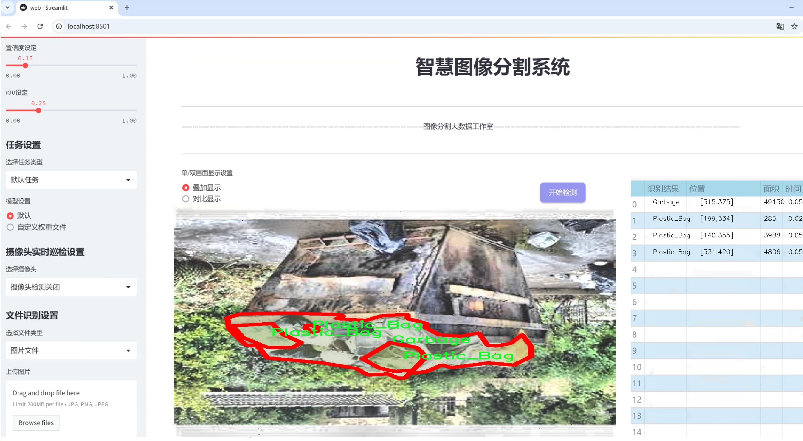
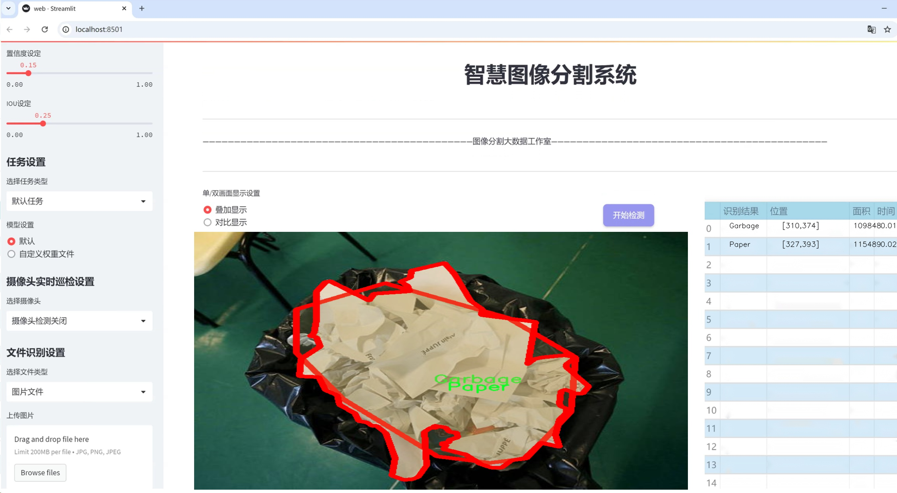
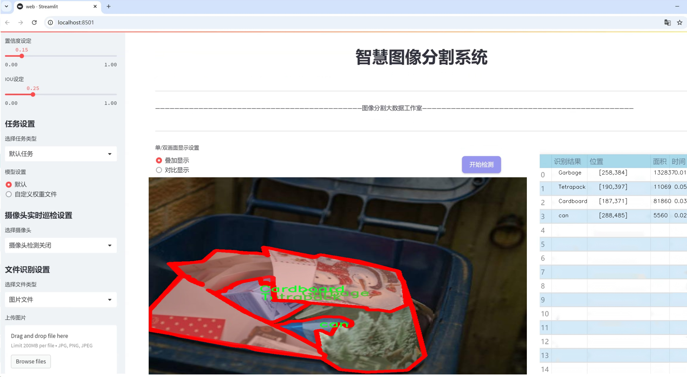
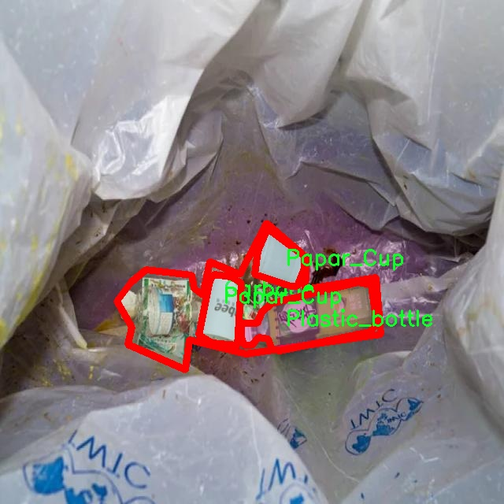
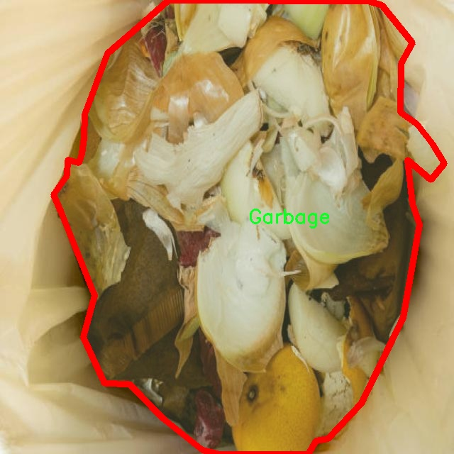
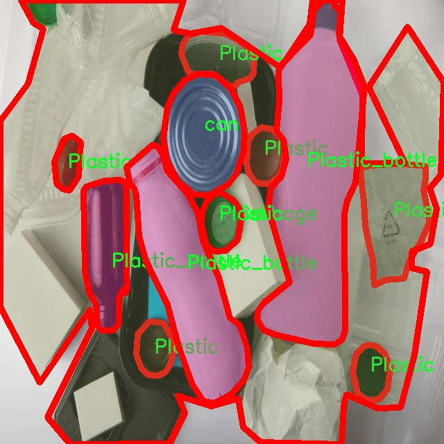
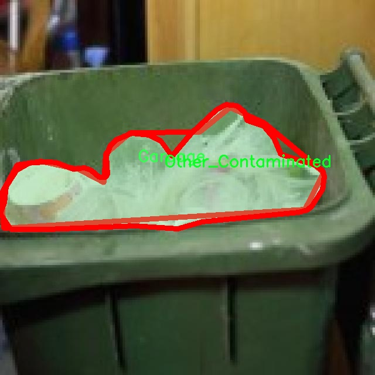
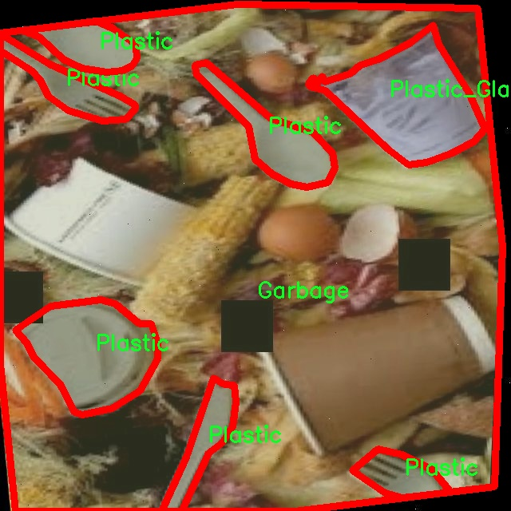

# 垃圾分类分割系统源码＆数据集分享
 [yolov8-seg-EfficientRepBiPAN＆yolov8-seg-FocalModulation等50+全套改进创新点发刊_一键训练教程_Web前端展示]

### 1.研究背景与意义

项目参考[ILSVRC ImageNet Large Scale Visual Recognition Challenge](https://gitee.com/YOLOv8_YOLOv11_Segmentation_Studio/projects)

项目来源[AAAI Global Al lnnovation Contest](https://kdocs.cn/l/cszuIiCKVNis)

研究背景与意义

随着城市化进程的加快和人口的不断增长，垃圾产生量日益增加，垃圾分类已成为现代城市管理中亟待解决的重要问题。有效的垃圾分类不仅能够减少垃圾处理的成本，还能促进资源的回收利用，降低环境污染。因此，如何提高垃圾分类的效率和准确性，成为了环境科学、计算机视觉及人工智能等多个领域研究的热点之一。

近年来，深度学习技术的迅猛发展为垃圾分类提供了新的解决方案。尤其是目标检测和实例分割技术的进步，使得计算机能够更为精准地识别和分类不同类型的垃圾。YOLO（You Only Look Once）系列模型以其高效的实时检测能力和较高的准确率，逐渐成为垃圾分类领域的主流选择。YOLOv8作为该系列的最新版本，具备了更强的特征提取能力和更快的推理速度，为垃圾分类分割系统的构建提供了坚实的基础。

本研究基于改进的YOLOv8模型，旨在构建一个高效的垃圾分类分割系统。我们使用的数据集“WasteInstanceSegment_2400_Images”包含2600张图像，涵盖36类垃圾，包括铝箔、纸板、电子废物、塑料瓶等多种常见垃圾。这一丰富的类别设置使得模型在训练过程中能够学习到更为全面的垃圾特征，提升其分类和分割的准确性。通过对这些图像的深入分析和处理，我们希望能够实现对不同类型垃圾的精准识别与分割，从而为后续的自动化垃圾分类提供支持。

本研究的意义不仅在于技术层面的创新，更在于其对社会和环境的积极影响。通过提高垃圾分类的自动化程度，我们能够有效降低人工分类的工作量，减少人为错误，提升垃圾分类的整体效率。此外，准确的垃圾分类将促进资源的回收利用，减少垃圾填埋和焚烧带来的环境负担，从而为可持续发展贡献力量。

此外，随着公众环保意识的增强，社会对垃圾分类的需求日益增加。基于改进YOLOv8的垃圾分类分割系统，不仅可以为城市管理者提供高效的垃圾处理方案，还能为公众提供便捷的垃圾分类指导，进一步提升社会对垃圾分类的参与度和认知度。

综上所述，本研究在技术创新、社会效益和环境保护等多个方面具有重要的研究背景与意义。通过构建基于改进YOLOv8的垃圾分类分割系统，我们期望能够为解决当前垃圾分类面临的挑战提供切实可行的方案，为实现更为清洁和可持续的城市环境贡献一份力量。

### 2.图片演示







##### 注意：由于此博客编辑较早，上面“2.图片演示”和“3.视频演示”展示的系统图片或者视频可能为老版本，新版本在老版本的基础上升级如下：（实际效果以升级的新版本为准）

  （1）适配了YOLOV8的“目标检测”模型和“实例分割”模型，通过加载相应的权重（.pt）文件即可自适应加载模型。

  （2）支持“图片识别”、“视频识别”、“摄像头实时识别”三种识别模式。

  （3）支持“图片识别”、“视频识别”、“摄像头实时识别”三种识别结果保存导出，解决手动导出（容易卡顿出现爆内存）存在的问题，识别完自动保存结果并导出到tempDir中。

  （4）支持Web前端系统中的标题、背景图等自定义修改，后面提供修改教程。

  另外本项目提供训练的数据集和训练教程,暂不提供权重文件（best.pt）,需要您按照教程进行训练后实现图片演示和Web前端界面演示的效果。

### 3.视频演示

[3.1 视频演示](https://www.bilibili.com/video/BV1uJ1BYCEmW/)

### 4.数据集信息展示

##### 4.1 本项目数据集详细数据（类别数＆类别名）

nc: 36
names: ['Aluminium_foil', 'Background', 'Cardboard', 'Cig_bud', 'Cig_pack', 'Disposable', 'E-Waste', 'Foam Paper', 'Foam cups and plates', 'Garbage', 'Glass_bottle', 'Light bulbs', 'Mask', 'Metal', 'Nylon_sting', 'Other_Contaminated', 'Papar_Cup', 'Paper', 'Plastic', 'Plastic_Bag', 'Plastic_Container', 'Plastic_Glass', 'Plastic_Straw', 'Plastic_bottle', 'Plastic_tray', 'Plastic_wraper', 'Rubber', 'Steel_Bottle', 'Tetrapack', 'Thermocol', 'Toothpaste', 'can', 'contaminated_waste', 'diaper', 'top_view_waste', 'wood']


##### 4.2 本项目数据集信息介绍

数据集信息展示

在现代社会中，垃圾分类的有效性直接影响到环境保护和资源的再利用。为了提升垃圾分类的准确性和效率，我们构建了一个名为“WasteInstanceSegment_2400_Images”的数据集，旨在为改进YOLOv8-seg的垃圾分类分割系统提供支持。该数据集包含2400张高质量的图像，涵盖了多种垃圾类型，适用于深度学习模型的训练和测试。

“WasteInstanceSegment_2400_Images”数据集的设计考虑到了现实生活中垃圾的多样性和复杂性，包含了36个不同的类别。这些类别不仅包括常见的可回收物品，如铝箔、纸板和玻璃瓶，还涵盖了各种不可回收的垃圾，如烟蒂、一次性用品和电子废物。通过对这些类别的细致划分，我们希望能够提高模型对不同垃圾类型的识别能力，从而实现更为精确的垃圾分类。

数据集中包含的类别有：铝箔、背景、纸板、烟蒂、香烟包装、一次性产品、电子废物、泡沫纸、泡沫杯和盘子、垃圾、玻璃瓶、灯泡、口罩、金属、尼龙绳、其他污染物、纸杯、纸张、塑料、塑料袋、塑料容器、塑料玻璃、塑料吸管、塑料瓶、塑料托盘、塑料包装、橡胶、钢瓶、牛奶盒、热塑材料、牙膏管、罐头、污染废物、尿布、顶视图垃圾以及木材等。这些类别的设置不仅考虑了垃圾的物理特性，还反映了其在实际处理过程中的分类需求。

数据集中的每一张图像都经过精心标注，确保每个类别的物体在图像中都能被准确识别。标注工作由经验丰富的团队完成，采用了严格的质量控制标准，以确保数据的可靠性和有效性。每个类别的样本数量也经过合理分配，旨在为模型训练提供均衡的数据支持，避免因类别不平衡而导致的识别偏差。

在数据集的使用过程中，研究人员可以利用YOLOv8-seg模型进行训练，进一步提升模型在垃圾分类任务中的表现。YOLOv8-seg作为一种先进的目标检测与分割算法，能够在保持高精度的同时实现实时处理，这使得其在垃圾分类应用中具有广泛的前景。通过对“WasteInstanceSegment_2400_Images”数据集的训练，模型将能够学习到不同垃圾类别的特征，从而在实际应用中实现高效的自动分类。

综上所述，“WasteInstanceSegment_2400_Images”数据集不仅为垃圾分类研究提供了丰富的资源，也为未来的环境保护工作奠定了坚实的基础。通过不断优化和改进垃圾分类技术，我们期望能够在全球范围内推动可持续发展，减少垃圾对环境的影响。











### 5.全套项目环境部署视频教程（零基础手把手教学）

[5.1 环境部署教程链接（零基础手把手教学）](https://www.bilibili.com/video/BV1jG4Ve4E9t/?vd_source=bc9aec86d164b67a7004b996143742dc)


[5.2 安装Python虚拟环境创建和依赖库安装视频教程链接（零基础手把手教学）](https://www.bilibili.com/video/BV1nA4VeYEze/?vd_source=bc9aec86d164b67a7004b996143742dc)

### 6.手把手YOLOV8-seg训练视频教程（零基础小白有手就能学会）

[6.1 手把手YOLOV8-seg训练视频教程（零基础小白有手就能学会）](https://www.bilibili.com/video/BV1cA4VeYETe/?vd_source=bc9aec86d164b67a7004b996143742dc)


按照上面的训练视频教程链接加载项目提供的数据集，运行train.py即可开始训练



     Epoch   gpu_mem       box       obj       cls    labels  img_size
     1/200     0G   0.01576   0.01955  0.007536        22      1280: 100%|██████████| 849/849 [14:42<00:00,  1.04s/it]
               Class     Images     Labels          P          R     mAP@.5 mAP@.5:.95: 100%|██████████| 213/213 [01:14<00:00,  2.87it/s]
                 all       3395      17314      0.994      0.957      0.0957      0.0843

     Epoch   gpu_mem       box       obj       cls    labels  img_size
     2/200     0G   0.01578   0.01923  0.007006        22      1280: 100%|██████████| 849/849 [14:44<00:00,  1.04s/it]
               Class     Images     Labels          P          R     mAP@.5 mAP@.5:.95: 100%|██████████| 213/213 [01:12<00:00,  2.95it/s]
                 all       3395      17314      0.996      0.956      0.0957      0.0845

     Epoch   gpu_mem       box       obj       cls    labels  img_size
     3/200     0G   0.01561    0.0191  0.006895        27      1280: 100%|██████████| 849/849 [10:56<00:00,  1.29it/s]
               Class     Images     Labels          P          R     mAP@.5 mAP@.5:.95: 100%|███████   | 187/213 [00:52<00:00,  4.04it/s]
                 all       3395      17314      0.996      0.957      0.0957      0.0845


### 7.50+种全套YOLOV8-seg创新点代码加载调参视频教程（一键加载写好的改进模型的配置文件）

[7.1 50+种全套YOLOV8-seg创新点代码加载调参视频教程（一键加载写好的改进模型的配置文件）](https://www.bilibili.com/video/BV1Hw4VePEXv/?vd_source=bc9aec86d164b67a7004b996143742dc)

### 8.YOLOV8-seg图像分割算法原理

原始YOLOv8-seg算法原理

YOLOv8-seg算法是Ultralytics公司在2023年推出的YOLO系列的最新版本，它在前几代YOLO模型的基础上进行了重大改进，尤其是在目标检测和图像分割任务中展现出了更高的性能和灵活性。YOLOv8的设计理念围绕着快速、准确和易于使用的原则，旨在满足现代计算机视觉应用的需求。该算法的网络结构主要由输入层、主干网络、特征融合层（Neck）和输出层（Head）四个部分组成，每个部分都经过精心设计，以实现更高的检测精度和速度。

在输入层，YOLOv8采用了640x640的默认输入图像尺寸，然而在实际应用中，图像的长宽比往往不一致。为了解决这一问题，YOLOv8引入了自适应图片缩放技术。在推理阶段，算法会将较长的一边按比例缩小到指定尺寸，然后对缩小后的短边进行填充，这种方法能够有效减少信息冗余，提升目标检测的速度和准确性。此外，YOLOv8在训练过程中使用了Mosaic图像增强技术，通过随机选择四张图像进行缩放和拼接，生成新的训练样本。这种增强方法迫使模型学习不同位置和周围像素的特征，从而提高了模型的泛化能力和预测精度。

YOLOv8的主干网络部分进行了显著的改进，特别是在C2F模块的设计上。与YOLOv5中的C3模块相比，C2F模块引入了更多的梯度流分支，保证了模型的轻量化同时又提高了特征提取的精度。C2F模块通过将输入特征图分为两个分支，其中一个分支直接进行特征拼接，另一个分支则通过多个Bottleneck模块进行处理，最终将两个分支的特征叠加。这种设计不仅增强了特征提取的能力，还缓解了深层网络中的梯度消失问题，使得模型在训练过程中能够更好地收敛。

在特征融合层（Neck），YOLOv8采用了PAN-FPN结构，这一结构能够有效地融合不同尺度的特征图。通过自下而上的融合过程，YOLOv8能够将高层特征与中层和浅层特征进行深度结合，确保每一层特征图都包含丰富的语义信息和细节信息。这种特征融合的方式极大地提升了模型对不同尺寸目标的检测能力，尤其是在复杂场景中。

YOLOv8的输出层（Head）部分则进行了结构上的重大变革，采用了Decoupled-Head（解耦头）设计。这一设计将目标检测和分类任务分开处理，分别通过不同的卷积层进行特征提取和预测。这种解耦的方式不仅提高了模型的灵活性，还能够更好地处理目标的定位和分类问题。此外，YOLOv8抛弃了传统的Anchor-Based方法，转而采用Anchor-Free的策略。这一创新使得模型不再依赖于预设的锚框，而是将目标检测问题转化为关键点检测，极大地简化了模型的结构，提高了检测的精度和速度。

在损失函数的设计上，YOLOv8引入了Distribution Focal Loss（DFL）和CIoU Loss的组合，以提高模型在回归任务中的表现。DFL能够有效地处理样本不平衡问题，聚焦于难以分类的样本，从而提升模型的学习效果。而CIoU Loss则在边界框回归中提供了更为精确的损失计算，确保模型能够快速聚焦于目标的真实位置。

YOLOv8-seg算法的这些创新使其在目标检测和图像分割任务中表现出色，尤其是在处理复杂背景和小目标时，能够有效降低误检率和漏检率。尽管在一些特定场景下仍然存在一定的挑战，例如在复杂水面环境中的小目标检测，但YOLOv8-seg的整体性能已然达到了一个新的高度。

总的来说，YOLOv8-seg算法通过对网络结构的优化、特征融合的改进以及损失函数的创新，展现出了极高的灵活性和准确性。它不仅适用于传统的目标检测任务，还在图像分割领域展现了强大的能力，为计算机视觉的发展提供了新的思路和方向。随着YOLOv8-seg的不断完善和应用，我们可以期待其在更广泛的领域中发挥重要作用。


### 9.系统功能展示（检测对象为举例，实际内容以本项目数据集为准）

图9.1.系统支持检测结果表格显示

  图9.2.系统支持置信度和IOU阈值手动调节

  图9.3.系统支持自定义加载权重文件best.pt(需要你通过步骤5中训练获得)

  图9.4.系统支持摄像头实时识别

  图9.5.系统支持图片识别

  图9.6.系统支持视频识别

  图9.7.系统支持识别结果文件自动保存

  图9.8.系统支持Excel导出检测结果数据


### 10.50+种全套YOLOV8-seg创新点原理讲解（非科班也可以轻松写刊发刊，V11版本正在科研待更新）

#### 10.1 由于篇幅限制，每个创新点的具体原理讲解就不一一展开，具体见下列网址中的创新点对应子项目的技术原理博客网址【Blog】：


[10.1 50+种全套YOLOV8-seg创新点原理讲解链接](https://gitee.com/qunmasj/good)

#### 10.2 部分改进模块原理讲解(完整的改进原理见上图和技术博客链接)
### CBAM空间注意力机制
近年来，随着深度学习研究方向的火热，注意力机制也被广泛地应用在图像识别、语音识别和自然语言处理等领域，注意力机制在深度学习任务中发挥着举足轻重的作用。注意力机制借鉴于人类的视觉系统，例如，人眼在看到一幅画面时，会倾向于关注画面中的重要信息，而忽略其他可见的信息。深度学习中的注意力机制和人类视觉的注意力机制相似，通过扫描全局数据，从大量数据中选择出需要重点关注的、对当前任务更为重要的信息，然后对这部分信息分配更多的注意力资源，从这些信息中获取更多所需要的细节信息，而抑制其他无用的信息。而在深度学习中，则具体表现为给感兴趣的区域更高的权重，经过网络的学习和调整，得到最优的权重分配，形成网络模型的注意力，使网络拥有更强的学习能力，加快网络的收敛速度。
注意力机制通常可分为软注意力机制和硬注意力机制[4-5]。软注意力机制在选择信息时，不是从输入的信息中只选择1个，而会用到所有输入信息，只是各个信息对应的权重分配不同，然后输入网络模型进行计算;硬注意力机制则是从输入的信息中随机选取一个或者选择概率最高的信息，但是这一步骤通常是不可微的，导致硬注意力机制更难训练。因此，软注意力机制应用更为广泛，按照原理可将软注意力机制划分为:通道注意力机制（channel attention)、空间注意力机制(spatial attention）和混合域注意力机制(mixed attention)。
通道注意力机制的本质建立各个特征通道之间的重要程度，对感兴趣的通道进行重点关注，弱化不感兴趣的通道的作用;空间注意力的本质则是建模了整个空间信息的重要程度，然后对空间内感兴趣的区域进行重点关注，弱化其余非感兴趣区域的作用;混合注意力同时运用了通道注意力和空间注意力，两部分先后进行或并行，形成对通道特征和空间特征同时关注的注意力模型。

卷积层注意力模块(Convolutional Block Attention Module，CBAM）是比较常用的混合注意力模块，其先后集中了通道注意力模块和空间注意力模块，网络中加入该模块能有效提高网络性能，减少网络模型的计算量，模块结构如图所示。输入特征图首先经过分支的通道注意力模块，然后和主干的原特征图融合，得到具有通道注意力的特征图，接着经过分支的空间注意力模块，在和主干的特征图融合后，得到同时具有通道特征注意力和空间特征注意力的特征图。CBAM模块不改变输入特征图的大小，因此该模块是一个“即插即用”的模块，可以插入网络的任何位置。

通道注意力模块的结构示意图如图所示，通道注意力模块分支并行地对输入的特征图进行最大池化操作和平均池化操作，然后利用多层感知机对结果进行变换，得到应用于两个通道的变换结果，最后经过sigmoid激活函数将变换结果融合，得到具有通道注意力的通道特征图。

空间注意力模块示意图如图所示，将通道注意力模块输出的特征图作为该模块的输入特征图，首先对输入特征图进行基于通道的最大池化操作和平均池化操作，将两部分得到的结果拼接起来，然后通过卷积得到降为Ⅰ通道的特征图，最后通过sigmoid激活函数生成具有空间注意力的特征图。


### 11.项目核心源码讲解（再也不用担心看不懂代码逻辑）

#### 11.1 ui.py

以下是对给定代码的核心部分进行提炼和详细注释的版本：

```python
import sys
import subprocess

def run_script(script_path):
    """
    使用当前 Python 环境运行指定的脚本。

    Args:
        script_path (str): 要运行的脚本路径

    Returns:
        None
    """
    # 获取当前 Python 解释器的路径
    python_path = sys.executable

    # 构建运行命令，使用 streamlit 运行指定的脚本
    command = f'"{python_path}" -m streamlit run "{script_path}"'

    # 执行命令并等待其完成
    result = subprocess.run(command, shell=True)
    
    # 检查命令执行结果，如果返回码不为0，表示出错
    if result.returncode != 0:
        print("脚本运行出错。")

# 主程序入口
if __name__ == "__main__":
    # 指定要运行的脚本路径
    script_path = "web.py"  # 这里可以直接指定脚本名，假设它在当前目录下

    # 调用函数运行脚本
    run_script(script_path)
```

### 代码核心部分说明：

1. **导入模块**：
   - `sys`：用于获取当前 Python 解释器的路径。
   - `subprocess`：用于执行外部命令。

2. **`run_script` 函数**：
   - 功能：运行指定的 Python 脚本。
   - 参数：`script_path`，表示要运行的脚本的路径。
   - 实现：
     - 使用 `sys.executable` 获取当前 Python 解释器的路径。
     - 构建命令字符串，使用 `streamlit` 模块运行指定的脚本。
     - 使用 `subprocess.run` 执行命令，并等待其完成。
     - 检查返回码，如果不为0，则输出错误信息。

3. **主程序入口**：
   - 使用 `if __name__ == "__main__":` 确保只有在直接运行该脚本时才会执行以下代码。
   - 指定要运行的脚本路径（这里假设脚本名为 `web.py`）。
   - 调用 `run_script` 函数来执行该脚本。 

通过这些核心部分和注释，可以清晰地理解代码的功能和实现方式。

这个程序文件 `ui.py` 的主要功能是运行一个指定的 Python 脚本，具体来说是使用 Streamlit 框架来启动一个 Web 应用。程序的实现过程可以分为几个关键部分。

首先，文件导入了必要的模块，包括 `sys`、`os` 和 `subprocess`。其中，`sys` 模块用于访问与 Python 解释器相关的变量和函数，`os` 模块提供了与操作系统交互的功能，而 `subprocess` 模块则用于创建新进程、连接到它们的输入/输出/错误管道，并获取它们的返回码。

接下来，程序定义了一个名为 `run_script` 的函数，该函数接受一个参数 `script_path`，表示要运行的脚本的路径。在函数内部，首先获取当前 Python 解释器的路径，这样可以确保使用正确的 Python 环境来运行脚本。然后，构建一个命令字符串，该命令使用 Streamlit 的 `run` 命令来启动指定的脚本。这个命令的格式是 `"{python_path}" -m streamlit run "{script_path}"`，其中 `{python_path}` 和 `{script_path}` 分别被替换为实际的 Python 解释器路径和脚本路径。

接着，使用 `subprocess.run` 方法执行构建好的命令。这个方法会在新的 shell 中运行命令，并等待命令执行完成。执行完成后，程序检查返回码，如果返回码不为 0，表示脚本运行出错，此时会打印出一条错误信息。

最后，在 `if __name__ == "__main__":` 这部分，程序指定了要运行的脚本路径，这里使用了 `abs_path` 函数来获取 `web.py` 的绝对路径。然后调用 `run_script` 函数来执行这个脚本。

总的来说，这个 `ui.py` 文件的作用是提供一个简单的接口来运行一个 Streamlit Web 应用，通过指定脚本路径，用户可以方便地启动相关的 Web 服务。

#### 11.2 ultralytics\nn\modules\head.py

以下是代码中最核心的部分，并附上详细的中文注释：

```python
import torch
import torch.nn as nn

class Detect(nn.Module):
    """YOLOv8 检测头，用于目标检测模型。"""
    
    def __init__(self, nc=80, ch=()):
        """初始化 YOLOv8 检测层，指定类别数和通道数。
        
        参数:
            nc (int): 类别数，默认为 80。
            ch (tuple): 输入通道数的元组。
        """
        super().__init__()
        self.nc = nc  # 类别数
        self.nl = len(ch)  # 检测层的数量
        self.reg_max = 16  # DFL 通道数
        self.no = nc + self.reg_max * 4  # 每个锚点的输出数量
        self.stride = torch.zeros(self.nl)  # 在构建过程中计算的步幅
        c2, c3 = max((16, ch[0] // 4, self.reg_max * 4)), max(ch[0], min(self.nc, 100))  # 通道数
        # 定义两个卷积序列，cv2 用于回归，cv3 用于分类
        self.cv2 = nn.ModuleList(
            nn.Sequential(Conv(x, c2, 3), Conv(c2, c2, 3), nn.Conv2d(c2, 4 * self.reg_max, 1)) for x in ch)
        self.cv3 = nn.ModuleList(nn.Sequential(Conv(x, c3, 3), Conv(c3, c3, 3), nn.Conv2d(c3, self.nc, 1)) for x in ch)
        self.dfl = DFL(self.reg_max) if self.reg_max > 1 else nn.Identity()  # DFL 层

    def forward(self, x):
        """连接并返回预测的边界框和类别概率。
        
        参数:
            x (list): 输入特征图列表。
        
        返回:
            y (tensor): 输出的边界框和类别概率。
        """
        shape = x[0].shape  # 获取输入形状 BCHW
        for i in range(self.nl):
            # 将 cv2 和 cv3 的输出连接在一起
            x[i] = torch.cat((self.cv2[i](x[i]), self.cv3[i](x[i])), 1)
        
        # 如果处于训练模式，直接返回
        if self.training:
            return x
        
        # 如果是动态模式或形状发生变化，重新计算锚点和步幅
        elif self.dynamic or self.shape != shape:
            self.anchors, self.strides = (x.transpose(0, 1) for x in make_anchors(x, self.stride, 0.5))
            self.shape = shape

        # 将所有层的输出连接在一起
        x_cat = torch.cat([xi.view(shape[0], self.no, -1) for xi in x], 2)
        # 分割边界框和类别概率
        box, cls = x_cat.split((self.reg_max * 4, self.nc), 1)
        # 通过 DFL 处理边界框
        dbox = dist2bbox(self.dfl(box), self.anchors.unsqueeze(0), xywh=True, dim=1) * self.strides

        # 归一化边界框以减小量化误差
        img_h = shape[2] * self.stride[0]
        img_w = shape[3] * self.stride[0]
        img_size = torch.tensor([img_w, img_h, img_w, img_h], device=dbox.device).reshape(1, 4, 1)
        dbox /= img_size

        # 返回最终的输出
        y = torch.cat((dbox, cls.sigmoid()), 1)  # 将边界框和类别概率连接
        return y if self.export else (y, x)  # 根据导出模式返回不同的结果

    def bias_init(self):
        """初始化 Detect() 的偏置，警告：需要步幅可用。"""
        m = self  # self.model[-1]  # Detect() 模块
        for a, b, s in zip(m.cv2, m.cv3, m.stride):  # 遍历 cv2 和 cv3
            a[-1].bias.data[:] = 1.0  # 边界框的偏置
            b[-1].bias.data[:m.nc] = math.log(5 / m.nc / (640 / s) ** 2)  # 类别的偏置
```

### 代码核心部分说明：
1. **Detect 类**：这是 YOLOv8 的检测头，负责处理输入特征并生成边界框和类别概率。
2. **初始化方法 `__init__`**：设置类别数、通道数、输出数量等，并定义卷积层。
3. **前向传播方法 `forward`**：处理输入数据，计算边界框和类别概率，返回最终的输出。
4. **偏置初始化方法 `bias_init`**：用于初始化模型的偏置，以帮助模型更好地学习。

以上是 YOLOv8 检测头的核心部分和详细注释，其他类（如 Segment、Pose、Classify 和 RTDETRDecoder）也遵循类似的结构和逻辑。

这个程序文件是Ultralytics YOLO（You Only Look Once）模型的一个模块，主要用于实现模型的头部部分，包含了不同类型的检测、分割、姿态估计和分类功能。文件中定义了多个类，每个类代表一种特定的模型头，负责处理输入数据并生成相应的输出。

首先，`Detect`类是YOLOv8的检测头，负责处理目标检测任务。它初始化了模型的基本参数，如类别数量、通道数和输出数量。`forward`方法实现了前向传播，计算预测的边界框和类别概率。该方法还处理了动态锚框的生成，并在训练和推理模式下返回不同的输出。

接下来，`Segment`类继承自`Detect`，用于分割模型。它在初始化时增加了掩码和原型的数量，并定义了相应的卷积层。在前向传播中，它不仅返回检测结果，还返回掩码系数和原型。

`Pose`类同样继承自`Detect`，用于姿态估计任务。它初始化了关键点的形状，并在前向传播中计算关键点的预测，返回检测结果和关键点。

`Classify`类则是YOLOv8的分类头，负责将输入的特征图转换为类别预测。它使用卷积层和全局平均池化层来处理输入，并通过线性层输出最终的分类结果。

最后，`RTDETRDecoder`类实现了实时可变形Transformer解码器，结合了Transformer架构和可变形卷积，用于生成边界框和类别标签。它通过多个解码层处理输入特征，并返回最终的预测结果。该类还包括了一些用于锚框生成和输入处理的辅助方法。

整个文件通过定义这些类，提供了YOLOv8模型的核心功能，支持多种计算机视觉任务，包括目标检测、实例分割、姿态估计和图像分类。每个类的设计都考虑到了模型的灵活性和可扩展性，使得用户可以根据具体需求进行调整和优化。

#### 11.3 ultralytics\nn\extra_modules\ops_dcnv3\setup.py

以下是经过简化和注释的核心代码部分：

```python
# 导入必要的库
import os
import glob
import torch
from torch.utils.cpp_extension import CUDA_HOME, CppExtension, CUDAExtension
from setuptools import find_packages, setup

# 定义依赖包
requirements = ["torch", "torchvision"]

def get_extensions():
    # 获取当前文件的目录
    this_dir = os.path.dirname(os.path.abspath(__file__))
    # 定义扩展源代码的目录
    extensions_dir = os.path.join(this_dir, "src")

    # 查找主文件和CPU、CUDA源文件
    main_file = glob.glob(os.path.join(extensions_dir, "*.cpp"))
    source_cpu = glob.glob(os.path.join(extensions_dir, "cpu", "*.cpp"))
    source_cuda = glob.glob(os.path.join(extensions_dir, "cuda", "*.cu"))

    # 合并源文件
    sources = main_file + source_cpu
    extension = CppExtension  # 默认使用 CppExtension
    extra_compile_args = {"cxx": []}  # 编译参数
    define_macros = []  # 宏定义

    # 检查CUDA是否可用
    if torch.cuda.is_available() and CUDA_HOME is not None:
        extension = CUDAExtension  # 使用 CUDAExtension
        sources += source_cuda  # 添加CUDA源文件
        define_macros += [("WITH_CUDA", None)]  # 定义宏
        extra_compile_args["nvcc"] = []  # CUDA编译参数
    else:
        raise NotImplementedError('Cuda is not available')  # 如果CUDA不可用，抛出异常

    # 生成完整的源文件路径
    sources = [os.path.join(extensions_dir, s) for s in sources]
    include_dirs = [extensions_dir]  # 包含目录

    # 创建扩展模块
    ext_modules = [
        extension(
            "DCNv3",  # 模块名称
            sources,  # 源文件
            include_dirs=include_dirs,  # 包含目录
            define_macros=define_macros,  # 宏定义
            extra_compile_args=extra_compile_args,  # 编译参数
        )
    ]
    return ext_modules  # 返回扩展模块列表

# 设置包信息和扩展模块
setup(
    name="DCNv3",  # 包名称
    version="1.1",  # 版本号
    author="InternImage",  # 作者
    url="https://github.com/OpenGVLab/InternImage",  # 项目网址
    description="PyTorch Wrapper for CUDA Functions of DCNv3",  # 描述
    packages=find_packages(exclude=("configs", "tests")),  # 查找包，排除指定目录
    ext_modules=get_extensions(),  # 获取扩展模块
    cmdclass={"build_ext": torch.utils.cpp_extension.BuildExtension},  # 指定构建扩展的命令类
)
```

### 代码说明：
1. **导入库**：导入了必要的库，包括操作系统相关的库、PyTorch、CUDA扩展和setuptools。
2. **依赖包**：定义了项目所需的依赖包。
3. **获取扩展函数**：`get_extensions`函数负责查找源文件并设置扩展模块的编译参数。
   - 它首先确定当前目录和扩展源代码目录。
   - 然后查找主文件和CPU、CUDA的源文件。
   - 根据CUDA的可用性选择相应的扩展类型（`CppExtension`或`CUDAExtension`）。
   - 最后返回一个包含扩展模块的列表。
4. **设置包信息**：使用`setup`函数定义包的基本信息和扩展模块，准备安装。

这个 `setup.py` 文件是用于配置和构建一个名为 `DCNv3` 的 Python 包，该包是一个用于 PyTorch 的 CUDA 函数的封装。文件的开头包含版权声明和许可证信息，表明该代码由 OpenGVLab 开发，并遵循 MIT 许可证。

在代码中，首先导入了一些必要的模块，包括 `os` 和 `glob` 用于文件路径处理，`torch` 用于 PyTorch 的相关功能，以及 `torch.utils.cpp_extension` 中的 `CUDA_HOME`、`CppExtension` 和 `CUDAExtension`，这些都是用于扩展模块的构建工具。接着，定义了一个 `requirements` 列表，列出了该包所需的依赖项，包括 `torch` 和 `torchvision`。

`get_extensions` 函数的主要作用是查找和配置需要编译的源文件。首先，它获取当前文件的目录，并构建出扩展模块的源文件目录。然后，使用 `glob` 模块查找所有的 C++ 源文件（`.cpp`）和 CUDA 源文件（`.cu`）。这些源文件被分为主要文件、CPU 源文件和 CUDA 源文件。

接下来，代码判断是否可以使用 CUDA。如果 CUDA 可用且 `CUDA_HOME` 不为 `None`，则将扩展类型设置为 `CUDAExtension`，并将 CUDA 源文件添加到源列表中，同时定义一个宏 `WITH_CUDA`。如果 CUDA 不可用，则抛出一个 `NotImplementedError` 异常，提示 CUDA 不可用。

然后，代码将所有源文件的路径进行组合，并设置包含目录。接着，创建一个扩展模块列表 `ext_modules`，其中包含了 `DCNv3` 模块的配置信息，包括模块名称、源文件、包含目录、宏定义和编译参数。

最后，调用 `setup` 函数来配置包的元数据，包括包名、版本、作者、项目网址、描述、要包含的包（排除 `configs` 和 `tests` 目录），以及通过 `get_extensions` 函数获取的扩展模块列表。同时，指定 `cmdclass` 为 `torch.utils.cpp_extension.BuildExtension`，以便在构建时使用 PyTorch 的扩展构建工具。

总体来说，这个 `setup.py` 文件的主要功能是为 `DCNv3` 模块的构建和安装提供必要的配置，确保能够正确编译和链接 CUDA 相关的代码。

#### 11.4 ultralytics\nn\extra_modules\ops_dcnv3\test.py

以下是代码中最核心的部分，并附上详细的中文注释：

```python
import torch
from functions.dcnv3_func import DCNv3Function, dcnv3_core_pytorch

# 输入和输出的尺寸
H_in, W_in = 8, 8  # 输入图像的高度和宽度
N, M, D = 2, 4, 16  # N为批量大小，M为通道数，D为特征维度
Kh, Kw = 3, 3  # 卷积核的高度和宽度
remove_center = False  # 是否移除中心点
P = Kh * Kw - remove_center  # 每个卷积核的有效点数
offset_scale = 2.0  # 偏移量的缩放因子
pad = 1  # 填充大小
dilation = 1  # 膨胀率
stride = 1  # 步幅
# 计算输出的高度和宽度
H_out = (H_in + 2 * pad - (dilation * (Kh - 1) + 1)) // stride + 1
W_out = (W_in + 2 * pad - (dilation * (Kw - 1) + 1)) // stride + 1

@torch.no_grad()
def check_forward_equal_with_pytorch_double():
    # 生成随机输入、偏移量和掩码
    input = torch.rand(N, H_in, W_in, M*D).cuda() * 0.01
    offset = torch.rand(N, H_out, W_out, M*P*2).cuda() * 10
    mask = torch.rand(N, H_out, W_out, M, P).cuda() + 1e-5
    mask /= mask.sum(-1, keepdim=True)  # 归一化掩码
    mask = mask.reshape(N, H_out, W_out, M*P)

    # 使用PyTorch的核心函数计算输出
    output_pytorch = dcnv3_core_pytorch(
        input.double(),
        offset.double(),
        mask.double(),
        Kh, Kw, stride, stride, Kh // 2, Kw // 2, dilation, dilation, M, D, offset_scale, remove_center).detach().cpu()

    # 使用自定义的DCNv3函数计算输出
    output_cuda = DCNv3Function.apply(
        input.double(),
        offset.double(),
        mask.double(),
        Kh, Kw, stride, stride, Kh // 2, Kw // 2, dilation, dilation, M, D, offset_scale,
        im2col_step=2, remove_center).detach().cpu()

    # 检查两个输出是否相近
    fwdok = torch.allclose(output_cuda, output_pytorch)
    max_abs_err = (output_cuda - output_pytorch).abs().max()  # 最大绝对误差
    max_rel_err = ((output_cuda - output_pytorch).abs() / output_pytorch.abs()).max()  # 最大相对误差
    print('>>> forward double')
    print(f'* {fwdok} check_forward_equal_with_pytorch_double: max_abs_err {max_abs_err:.2e} max_rel_err {max_rel_err:.2e}')

if __name__ == '__main__':
    check_forward_equal_with_pytorch_double()  # 执行前向传播一致性检查
```

### 代码注释说明：
1. **导入库**：导入了PyTorch和自定义的DCNv3函数。
2. **参数定义**：定义了输入图像的尺寸、卷积核的尺寸、批量大小、通道数等参数。
3. **输出尺寸计算**：根据输入尺寸和卷积参数计算输出的高度和宽度。
4. **前向传播一致性检查**：
   - 随机生成输入、偏移量和掩码。
   - 使用PyTorch的核心函数和自定义DCNv3函数计算输出。
   - 检查两个输出是否相近，并计算最大绝对误差和最大相对误差。

以上是代码的核心部分及其详细注释，主要用于验证自定义卷积操作的正确性。

这个程序文件是一个用于测试和验证深度学习模型中DCNv3（Deformable Convolutional Networks Version 3）功能的脚本。文件中使用了PyTorch框架，主要包含了前向和反向传播的正确性检查，以及性能测试。

首先，程序导入了一些必要的库，包括PyTorch和自定义的DCNv3函数模块。接着，定义了一些参数，如输入和输出的高度和宽度、通道数、卷积核的大小、填充、步幅等。这些参数用于设置DCNv3操作的输入输出维度。

程序中定义了多个函数来进行不同的测试。`check_forward_equal_with_pytorch_double`和`check_forward_equal_with_pytorch_float`函数用于检查DCNv3的前向传播结果是否与PyTorch内置的实现相等。它们生成随机输入、偏移量和掩码，并调用自定义的DCNv3函数和PyTorch的实现进行比较，输出最大绝对误差和相对误差。

类似地，`check_backward_equal_with_pytorch_double`和`check_backward_equal_with_pytorch_float`函数用于检查反向传播的梯度是否一致。它们同样生成随机输入，并计算梯度，比较自定义实现和PyTorch实现的梯度结果。

`check_time_cost`函数用于测试DCNv3操作的时间性能。它生成较大的输入数据，并多次调用DCNv3函数，计算平均时间消耗，以评估其在实际应用中的效率。

在`__main__`部分，程序依次调用前向和反向传播的检查函数，并进行时间性能测试。通过这些测试，程序确保了DCNv3实现的正确性和性能，适合在深度学习模型中使用。

#### 11.5 train.py

以下是代码中最核心的部分，并附上详细的中文注释：

```python
import os
import torch
import yaml
from ultralytics import YOLO  # 导入YOLO模型

if __name__ == '__main__':  # 确保该模块被直接运行时才执行以下代码
    # 设置训练参数
    workers = 1  # 数据加载的工作进程数量
    batch = 8  # 每个批次的样本数量，视显存情况调整
    device = "0" if torch.cuda.is_available() else "cpu"  # 判断是否使用GPU

    # 获取数据集的yaml配置文件的绝对路径
    data_path = abs_path(f'datasets/data/data.yaml', path_type='current')

    # 将路径格式转换为Unix风格
    unix_style_path = data_path.replace(os.sep, '/')
    # 获取目录路径
    directory_path = os.path.dirname(unix_style_path)

    # 读取YAML文件，保持原有顺序
    with open(data_path, 'r') as file:
        data = yaml.load(file, Loader=yaml.FullLoader)

    # 修改YAML文件中的训练、验证和测试数据路径
    if 'train' in data and 'val' in data and 'test' in data:
        data['train'] = directory_path + '/train'  # 设置训练数据路径
        data['val'] = directory_path + '/val'      # 设置验证数据路径
        data['test'] = directory_path + '/test'    # 设置测试数据路径

        # 将修改后的数据写回YAML文件
        with open(data_path, 'w') as file:
            yaml.safe_dump(data, file, sort_keys=False)

    # 加载YOLO模型配置文件并加载预训练权重
    model = YOLO(r"C:\codeseg\codenew\50+种YOLOv8算法改进源码大全和调试加载训练教程（非必要）\改进YOLOv8模型配置文件\yolov8-seg-C2f-Faster.yaml").load("./weights/yolov8s-seg.pt")

    # 开始训练模型
    results = model.train(
        data=data_path,  # 指定训练数据的配置文件路径
        device=device,  # 指定使用的设备（GPU或CPU）
        workers=workers,  # 指定数据加载的工作进程数量
        imgsz=640,  # 输入图像的大小
        epochs=100,  # 训练的轮数
        batch=batch,  # 每个批次的样本数量
    )
```

### 代码注释说明：
1. **导入必要的库**：引入操作系统相关的库、PyTorch库、YAML解析库和YOLO模型库。
2. **设置训练参数**：定义数据加载的工作进程数量、批次大小和设备类型（GPU或CPU）。
3. **获取数据集路径**：通过`abs_path`函数获取数据集配置文件的绝对路径，并转换为Unix风格的路径。
4. **读取和修改YAML文件**：读取YAML文件内容，更新训练、验证和测试数据的路径，并将修改后的内容写回文件。
5. **加载YOLO模型**：指定模型配置文件和预训练权重，创建YOLO模型实例。
6. **开始训练模型**：调用`train`方法进行模型训练，传入训练数据路径、设备、工作进程数量、图像大小、训练轮数和批次大小等参数。

该程序文件 `train.py` 是一个用于训练 YOLO（You Only Look Once）模型的脚本。程序首先导入所需的库，包括操作系统库、PyTorch、YAML 解析库以及 YOLO 模型库。它还设置了 Matplotlib 的后端为 TkAgg，以便于可视化。

在主程序部分，首先定义了一些训练参数，包括工作进程数 `workers`、批次大小 `batch`，并根据是否有可用的 GPU 设备来设置训练设备为 GPU 或 CPU。接着，程序通过 `abs_path` 函数获取数据集配置文件的绝对路径，该文件为 YAML 格式，包含训练、验证和测试数据的路径。

程序将路径中的分隔符统一为 Unix 风格的斜杠，并提取出数据集的目录路径。随后，程序打开 YAML 文件并读取内容。如果 YAML 文件中包含 `train`、`val` 和 `test` 字段，程序会将这些字段的值修改为相应的绝对路径，并将修改后的内容写回 YAML 文件。这一步确保了模型能够正确找到训练、验证和测试数据。

接下来，程序加载一个 YOLO 模型配置文件，并使用预训练的权重文件进行初始化。此处提供了多种模型配置文件的注释，用户可以根据需要选择不同的模型进行测试。

最后，程序调用 `model.train()` 方法开始训练模型，传入训练数据的配置文件路径、设备、工作进程数、输入图像大小、训练轮数和批次大小等参数。通过这些设置，程序将启动训练过程，模型将在指定的配置下进行学习。

#### 11.6 ultralytics\nn\extra_modules\ops_dcnv3\functions\__init__.py

```python
# --------------------------------------------------------
# InternImage
# 版权所有 (c) 2022 OpenGVLab
# 根据 MIT 许可证进行许可 [详见 LICENSE]
# --------------------------------------------------------

# 从 dcnv3_func 模块中导入 DCNv3Function 和 dcnv3_core_pytorch
# DCNv3Function 是一个自定义的函数，用于实现深度可分离卷积（Deformable Convolution）
# dcnv3_core_pytorch 可能包含核心的 PyTorch 实现代码
from .dcnv3_func import DCNv3Function, dcnv3_core_pytorch
```

### 注释说明：
1. **版权信息**：开头部分包含版权声明和许可证信息，表明代码的所有权和使用条款。
2. **模块导入**：`from .dcnv3_func import DCNv3Function, dcnv3_core_pytorch` 这一行是核心代码，负责从同一包中的 `dcnv3_func` 模块导入两个重要的组件。
   - `DCNv3Function`：通常用于实现可变形卷积的功能，这种卷积可以在处理图像时更灵活地适应形状变化。
   - `dcnv3_core_pytorch`：可能是实现可变形卷积的核心功能，使用 PyTorch 框架进行深度学习模型的构建和训练。

这个程序文件的名称是 `__init__.py`，位于 `ultralytics\nn\extra_modules\ops_dcnv3\functions` 目录下。该文件的主要功能是初始化一个 Python 包，并导入必要的模块。

文件开头有一些注释，说明了版权信息和许可证类型。可以看到，版权归属于 OpenGVLab，并且该文件遵循 MIT 许可证，这意味着它可以被自由使用和修改，只要遵循相应的条款。

接下来的代码行是从同一目录下的 `dcnv3_func` 模块中导入了两个对象：`DCNv3Function` 和 `dcnv3_core_pytorch`。这表明 `dcnv3_func` 模块中定义了与 DCNv3（Deformable Convolutional Networks v3）相关的功能或类，可能用于实现一些深度学习中的变形卷积操作。

总的来说，这个 `__init__.py` 文件的作用是将 `dcnv3_func` 模块中的特定功能引入到当前包的命名空间中，使得在使用这个包时，可以直接访问 `DCNv3Function` 和 `dcnv3_core_pytorch`，而无需每次都显式地引用 `dcnv3_func` 模块。这种做法有助于提高代码的可读性和使用的便利性。

### 12.系统整体结构（节选）

### 整体功能和构架概括

该项目主要围绕 YOLO（You Only Look Once）模型的实现与训练，结合了深度学习中的变形卷积（DCN）技术，提供了一系列模块和工具来支持目标检测、分类、分割等计算机视觉任务。项目结构清晰，包含了模型定义、训练流程、测试验证、以及额外的功能模块（如变形卷积）。以下是对主要功能模块的概述：

- **模型定义**：包含 YOLO 模型的各个部分，如头部、主干等。
- **训练和验证**：提供训练脚本和验证脚本，支持模型的训练和性能评估。
- **额外模块**：实现了变形卷积的功能，提升了模型在复杂场景下的表现。
- **工具和实用函数**：提供了各种实用工具，如卡尔曼滤波器，用于跟踪和预测。

### 文件功能整理表

| 文件路径                                                | 功能描述                                                                                   |
|-------------------------------------------------------|------------------------------------------------------------------------------------------|
| `C:\codeseg\codenew\code\ui.py`                      | 启动 Streamlit Web 应用，提供一个简单的接口来运行 YOLO 模型的相关脚本。                       |
| `C:\codeseg\codenew\code\ultralytics\nn\modules\head.py` | 定义 YOLO 模型的头部部分，负责目标检测、分割、姿态估计和分类的实现。                          |
| `C:\codeseg\codenew\code\ultralytics\nn\extra_modules\ops_dcnv3\setup.py` | 配置和构建 DCNv3 模块的 Python 包，确保 CUDA 相关代码的编译和链接。                         |
| `C:\codeseg\codenew\code\ultralytics\nn\extra_modules\ops_dcnv3\test.py` | 测试 DCNv3 功能的正确性和性能，包括前向传播和反向传播的验证。                                |
| `C:\codeseg\codenew\code\train.py`                   | 训练 YOLO 模型的主脚本，设置训练参数并启动训练过程。                                        |
| `C:\codeseg\codenew\code\ultralytics\nn\extra_modules\ops_dcnv3\functions\__init__.py` | 初始化 DCNv3 功能模块，导入相关的功能和类以供使用。                                         |
| `C:\codeseg\codenew\code\ultralytics\models\yolo\classify\__init__.py` | 初始化 YOLO 分类模块，准备相关的分类功能。                                                  |
| `C:\codeseg\codenew\code\ultralytics\models\yolo\classify\val.py` | 实现 YOLO 分类模型的验证功能，评估模型在验证集上的表现。                                     |
| `C:\codeseg\codenew\code\ultralytics\nn\modules\block.py` | 定义模型的基本模块和构建块，可能包括卷积层、激活函数等。                                     |
| `C:\codeseg\codenew\code\ultralytics\nn\backbone\lsknet.py` | 实现 LSKNet 主干网络，作为 YOLO 模型的特征提取器。                                          |
| `C:\codeseg\codenew\code\ultralytics\trackers\utils\kalman_filter.py` | 实现卡尔曼滤波器，用于目标跟踪和状态预测。                                                  |
| `C:\codeseg\codenew\code\ultralytics\models\yolo\model.py` | 定义 YOLO 模型的整体结构和前向传播逻辑，整合各个模块。                                       |
| `C:\codeseg\codenew\code\ultralytics\models\fastsam\utils.py` | 提供 FastSAM 模型的实用工具和辅助函数，支持快速实例分割。                                     |

以上表格总结了每个文件的主要功能，展示了项目的整体结构和模块化设计。

注意：由于此博客编辑较早，上面“11.项目核心源码讲解（再也不用担心看不懂代码逻辑）”中部分代码可能会优化升级，仅供参考学习，完整“训练源码”、“Web前端界面”和“50+种创新点源码”以“14.完整训练+Web前端界面+50+种创新点源码、数据集获取”的内容为准。

### 13.图片、视频、摄像头图像分割Demo(去除WebUI)代码

在这个博客小节中，我们将讨论如何在不使用WebUI的情况下，实现图像分割模型的使用。本项目代码已经优化整合，方便用户将分割功能嵌入自己的项目中。
核心功能包括图片、视频、摄像头图像的分割，ROI区域的轮廓提取、类别分类、周长计算、面积计算、圆度计算以及颜色提取等。
这些功能提供了良好的二次开发基础。

### 核心代码解读

以下是主要代码片段，我们会为每一块代码进行详细的批注解释：

```python
import random
import cv2
import numpy as np
from PIL import ImageFont, ImageDraw, Image
from hashlib import md5
from model import Web_Detector
from chinese_name_list import Label_list

# 根据名称生成颜色
def generate_color_based_on_name(name):
    ......

# 计算多边形面积
def calculate_polygon_area(points):
    return cv2.contourArea(points.astype(np.float32))

...
# 绘制中文标签
def draw_with_chinese(image, text, position, font_size=20, color=(255, 0, 0)):
    image_pil = Image.fromarray(cv2.cvtColor(image, cv2.COLOR_BGR2RGB))
    draw = ImageDraw.Draw(image_pil)
    font = ImageFont.truetype("simsun.ttc", font_size, encoding="unic")
    draw.text(position, text, font=font, fill=color)
    return cv2.cvtColor(np.array(image_pil), cv2.COLOR_RGB2BGR)

# 动态调整参数
def adjust_parameter(image_size, base_size=1000):
    max_size = max(image_size)
    return max_size / base_size

# 绘制检测结果
def draw_detections(image, info, alpha=0.2):
    name, bbox, conf, cls_id, mask = info['class_name'], info['bbox'], info['score'], info['class_id'], info['mask']
    adjust_param = adjust_parameter(image.shape[:2])
    spacing = int(20 * adjust_param)

    if mask is None:
        x1, y1, x2, y2 = bbox
        aim_frame_area = (x2 - x1) * (y2 - y1)
        cv2.rectangle(image, (x1, y1), (x2, y2), color=(0, 0, 255), thickness=int(3 * adjust_param))
        image = draw_with_chinese(image, name, (x1, y1 - int(30 * adjust_param)), font_size=int(35 * adjust_param))
        y_offset = int(50 * adjust_param)  # 类别名称上方绘制，其下方留出空间
    else:
        mask_points = np.concatenate(mask)
        aim_frame_area = calculate_polygon_area(mask_points)
        mask_color = generate_color_based_on_name(name)
        try:
            overlay = image.copy()
            cv2.fillPoly(overlay, [mask_points.astype(np.int32)], mask_color)
            image = cv2.addWeighted(overlay, 0.3, image, 0.7, 0)
            cv2.drawContours(image, [mask_points.astype(np.int32)], -1, (0, 0, 255), thickness=int(8 * adjust_param))

            # 计算面积、周长、圆度
            area = cv2.contourArea(mask_points.astype(np.int32))
            perimeter = cv2.arcLength(mask_points.astype(np.int32), True)
            ......

            # 计算色彩
            mask = np.zeros(image.shape[:2], dtype=np.uint8)
            cv2.drawContours(mask, [mask_points.astype(np.int32)], -1, 255, -1)
            color_points = cv2.findNonZero(mask)
            ......

            # 绘制类别名称
            x, y = np.min(mask_points, axis=0).astype(int)
            image = draw_with_chinese(image, name, (x, y - int(30 * adjust_param)), font_size=int(35 * adjust_param))
            y_offset = int(50 * adjust_param)

            # 绘制面积、周长、圆度和色彩值
            metrics = [("Area", area), ("Perimeter", perimeter), ("Circularity", circularity), ("Color", color_str)]
            for idx, (metric_name, metric_value) in enumerate(metrics):
                ......

    return image, aim_frame_area

# 处理每帧图像
def process_frame(model, image):
    pre_img = model.preprocess(image)
    pred = model.predict(pre_img)
    det = pred[0] if det is not None and len(det)
    if det:
        det_info = model.postprocess(pred)
        for info in det_info:
            image, _ = draw_detections(image, info)
    return image

if __name__ == "__main__":
    cls_name = Label_list
    model = Web_Detector()
    model.load_model("./weights/yolov8s-seg.pt")

    # 摄像头实时处理
    cap = cv2.VideoCapture(0)
    while cap.isOpened():
        ret, frame = cap.read()
        if not ret:
            break
        ......

    # 图片处理
    image_path = './icon/OIP.jpg'
    image = cv2.imread(image_path)
    if image is not None:
        processed_image = process_frame(model, image)
        ......

    # 视频处理
    video_path = ''  # 输入视频的路径
    cap = cv2.VideoCapture(video_path)
    while cap.isOpened():
        ret, frame = cap.read()
        ......
```


### 14.完整训练+Web前端界面+50+种创新点源码、数据集获取


# [下载链接：https://mbd.pub/o/bread/ZpyWl5ly](https://mbd.pub/o/bread/ZpyWl5ly)